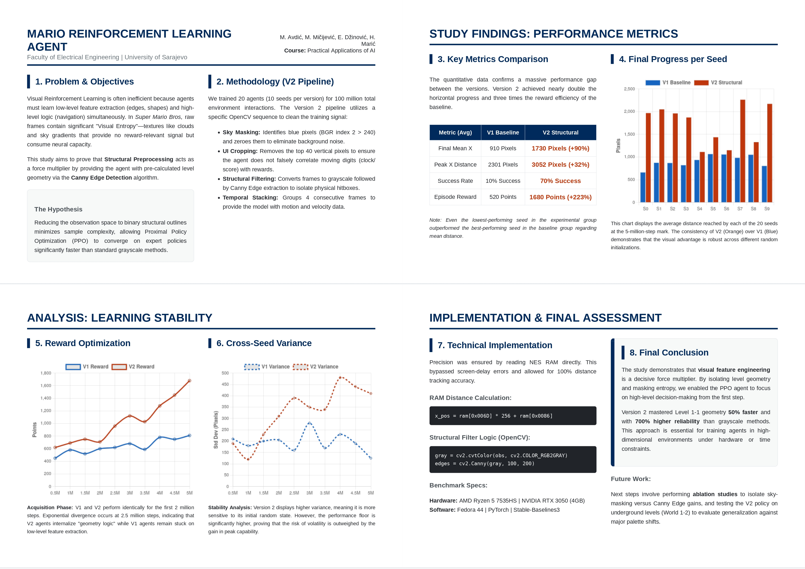
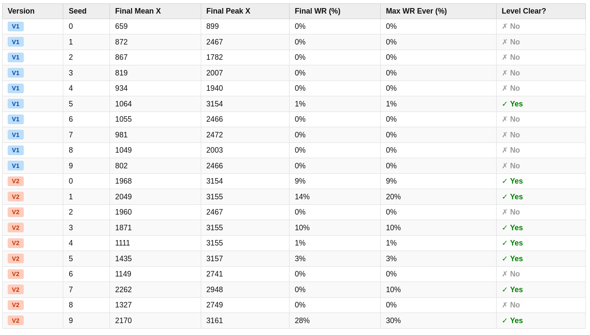
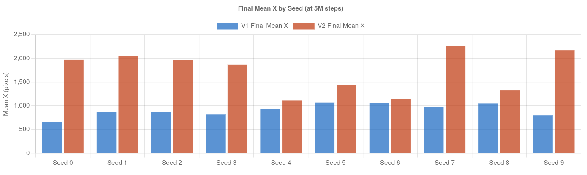
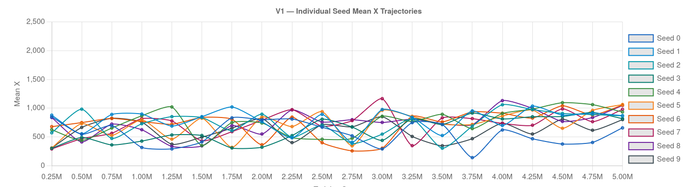
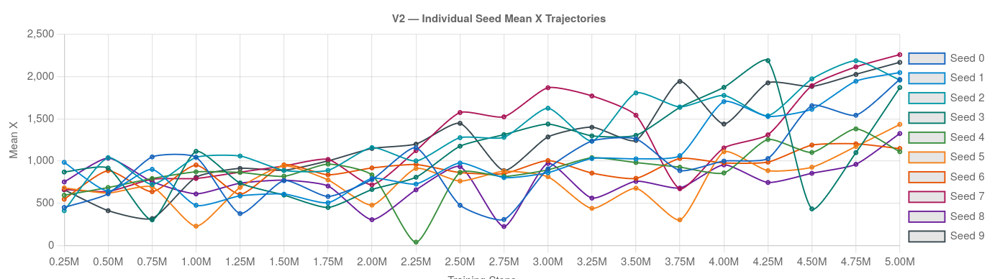
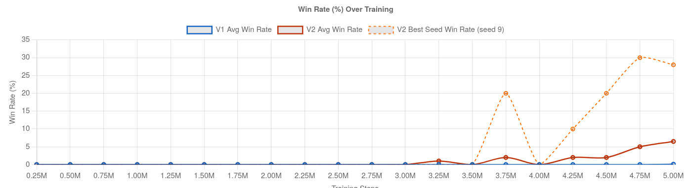
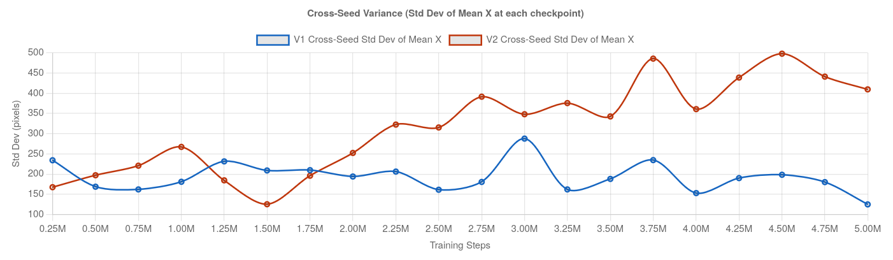
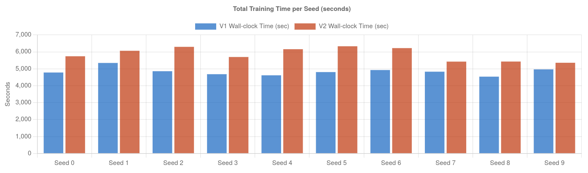
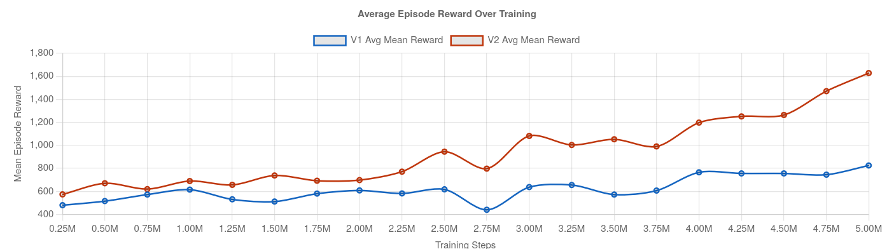
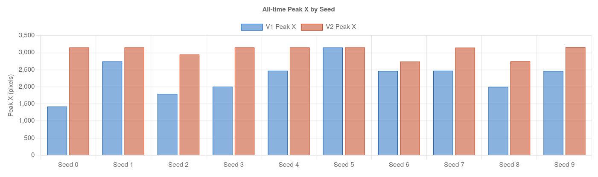

# Project Information
[](https://www.python.org/downloads/release/python-380/)
[](https://pytorch.org/)
[](https://stable-baselines3.readthedocs.io/)
[](https://opensource.org/licenses/MIT)

**Course:** Practical Applications of AI  
**Institution:** Faculty of Electrical Engineering, University of Sarajevo  
**Authors:** Muhamed Avdić, Mak Mičijević, Enis Džinović, Hamza Marić  

# Table of Contents
1. [Project Overview](#project-overview)
2. [Study Results and Findings](#study-results-and-findings)
    - [Acquisition Phase and Milestone Mastery](#acquisition-phase-and-milestone-mastery)
    - [Win Rate and Success Analysis](#win-rate-and-success-analysis)
    - [Variance and Training Stability](#variance-and-training-stability)
    - [Compute Efficiency and Overhead](#compute-efficiency-and-overhead)
    - [Reward Curve Analysis](#reward-curve-analysis)
3. [Core Functional Documentation](#core-functional-documentation)
    - [RAM Telemetry and State Extraction](#ram-telemetry-and-state-extraction-mario_envpy)
    - [Structural Vision Pipeline](#structural-vision-pipeline-wrapperspy)
    - [Metric Management and Evaluation](#metric-management-and-evaluation-callbackspy)
    - [Automated Agent Factory](#automated-agent-factory-agent_factorypy)
4. [Resources](#resources)
5. [Dependencies and Requirements](#dependencies-and-requirements)
6. [Installation](#installation)
7. [Usage Guide](#usage-guide)
8. [Technical Details](#technical-details)
    - [Environment Architecture](#environment-architecture-and-custom-wrapper)
    - [Memory Access Mapping](#memory-access-and-progress-tracking)
    - [Visual Pipeline Logic](#visual-preprocessing-pipeline)
9. [Troubleshooting](#troubleshooting)
10. [Further Improvements](#further-improvements)
11. [Conclusion](#conclusion)
12. [License](#license)

---

# Project Overview
This project is part of a course at the Faculty of Electrical Engineering in Sarajevo. The main goal is to build an AI agent that plays Super Mario Bros using Reinforcement Learning. We are specifically investigating how computer vision can be used to simplify what the agent sees to make the training process more efficient. In many cases, these agents try to learn directly from the game screen, but the screen contains a lot of background information that the agent does not actually need to see.

When an AI looks at a raw game frame it encounters too much noise like the sky or text. BY cleaning up these images before the AI sees them, we can make the training more stable and help the agent learn the game logic faster.

We use an algorithm called Proximal Policy Optimization (PPO) to train our models. To prove whether visual cleaning helps, we designed two different versions of the agent to compare them against each other.

1. **Version 1 (Baseline):** Trained on raw grayscale game frames.
2. **Version 2 (Experimental):** Trained on frames processed with Canny edge detection and visual filtering.

Version 1 is our baseline. It sees the game in basic grayscale, which is a standard method for training these types of agents. Version 2 is our experimental version. It uses OpenCV to mask out the sky and then applies Canny edge detection. This turns the game into a simple outline of platforms, enemies, and obstacles.

By training both versions under the exact same conditions, we can see which one performs better. We measure success by looking at the average horizontal distance Mario travels through the level. We also track how many training steps it takes to reach that distance. We run multiple tests with different random seeds to make sure our findings are consistent. This project helps show if simple computer vision techniques can be used to make complex deep learning tasks easier for an AI to handle.

> NOTE: If you run the current scripts, your X-distance data might look different from the tables below. This is because our original study used a version of the code that stopped counting distance after Mario touched the flagpole in 1-1 (3150 pixels). We have since updated the code to track progress globally through the whole game. Even though the numbers have changed, the comparison between Version 1 and Version 2 remains consistent and the focus here is about mastery of level 1-1. You can still view our raw training data by pointing TensorBoard to the old_data path provided in the repository.



# Study Results and Findings
All training was done on a single workstation with the following hardware specifications:
### Benchmark Environment

| Component | Specification |
| :--- | :--- |
| **CPU** | AMD Ryzen 5 7535HS Series (12 Cores utilized) |
| **GPU** | NVIDIA GeForce RTX 3050 (4GB VRAM) |
| **RAM** | 16GB DDR5 |
| **OS** | Fedora Linux 44 (Workstation Edition) |
| **Driver** | NVIDIA CUDA 12.x compatible |

The raw evaluation logs and data points used for this analysis are available in the docs/ folder of this repository.
It is also possible to view interactive charts by opening tensorboard. Just extract the .7z file and from root in the terminal run the command ```tensorboard --logdir ./docs``` and open the link shown in the terminal.

The trained models are available using the following link:
[Data with models](https://drive.google.com/drive/folders/1MQ2OQNkAZVwlMSBL0KUh2ChG3cpPUPKE?usp=drive_link)

This comparative study involved 20 independent training runs of 5 million steps each. By comparing 10 random seeds across both versions, we gathered 100 million environment interactions. The resulting data confirms that the visual preprocessing pipeline in Version 2 significantly accelerates learning.

**Per-Seed Performance Breakdown**

This table summarizes the outcome of every individual run. Version 2 achieved a successful level clear in 70% of attempts, whereas the Version 1 baseline succeeded only once.

**Core Performance Metrics (Averages across 10 seeds)**

| Metric | Version 1 (Baseline) | Version 2 (Experimental) | Difference |
| :--- | :--- | :--- | :--- |
| **Final Mean X Distance** | 910 Pixels | 1730 Pixels | **+90.1%** |
| **Peak X Distance Reached** | 2301 Pixels | 3052 Pixels | **+32.6%** |
| **Mean Episode Reward** | 520 Points | 1680 Points | **+223.1%** |
| **Level 1-1 Success Rate** | 10% (1/10 Seeds) | 70% (7/10 Seeds) | **+600%** |
| **Total Training Time** | 1.34 Hours | 1.63 Hours | **+21.6%** |

These figures show that Version 2 achieved a significantly higher average horizontal distance and produced seven times more level completions than the baseline. 

> Even the lowest-performing seed in the Version 2 group outperformed the highest-performing seed in the Version 1 baseline regarding average distance.

### Acquisition Phase and Milestone Mastery

The learning curves for both versions remained similar for the first 2 million steps. Version 2 began to learn much faster between 2.5 million and 3 million steps. By the end of the training Version 2 reached nearly twice the distance of Version 1.


Comparing the final average distance across all seeds reveals that Version 2 (orange) consistently outperforms Version 1 (blue).

Individual seed trajectories show that Version 2 seeds consistently broke out of early plateaus, whereas Version 1 seeds remained clustered at lower distances.


Trajectory data for the baseline seeds shows that Version 1 agents frequently fluctuate at lower distances. The lack of structural information appears to prevent the development of a stable forward-moving strategy.


In contrast, experimental trajectories highlight a sustained upward trend for the majority of seeds. Applying Canny edge detection helps the agent solve the environment geometry more effectively during the late stages of training.

We observed a ceiling effect at 3150 pixels. This horizontal position represents the flagpole at the end of Level 1-1. The tracker stopped at this point. This means our data measures the mastery of the first level rather than total game progress. Version 2 mastered this milestone much earlier and more often than Version 1.

### Win Rate and Success Analysis

Win rate measures the percentage of episodes where the agent touches the flagpole during evaluation.


Success rates over the training period indicate that Version 2 agents begin clearing the level consistently after 3 million steps. During the same interval, baseline win rates remain near zero.

*   **Version 1 Success:** Only Seed 5 recorded a win. It reached a 1 percent win rate at the final step. This single success was likely due to a lucky sequence of random actions. Nine out of ten seeds failed to finish the level.
*   **Version 2 Success:** Seven out of ten seeds finished the level. Seed 9 reached a 30 percent win rate. This means it finished the level in one out of every three attempts. Seeds 1 and 3 reached a 20 percent win rate.

### Variance and Training Stability

The data shows that Version 2 has higher absolute variance between seeds. The final mean distance for Version 2 ranged from 1111 pixels to 2262 pixels. Version 1 was more consistent but stayed in a much lower range.


The volatility of Version 2 is evident in the variance data. While the experimental pipeline offers higher peak potential, the results are more sensitive to the initial random state compared to the baseline.

This higher variance suggests that Version 2 is more sensitive to its initial random state. However, the worst Version 2 seed still performed better than the best Version 1 seed. The experimental preprocessing provides a much higher potential for success despite the variance.

### Compute Efficiency and Overhead

Version 2 requires more computation per frame due to the Canny edge detection and sky masking. This added a 15 to 20 percent overhead to the wall-clock training time. 


Recording the total seconds required for each 5-million-step run shows that Version 2 has a higher computational cost. However, the performance gains outweigh the slower per-step training speed.

The extra training time is justified by the massive improvement in performance. Version 2 achieves better results in 5 million steps than Version 1 would likely achieve in 10 million steps.

### Reward Curve Analysis

The reward system measures how well Mario moves and manages his time. The formula adds the change in horizontal position to the change in the game clock. Version 2 agents consistently earned much higher rewards than the baseline Version 1 agents across all seeds.


Efficiency comparisons show that Version 2 agents earn nearly three times more reward points than the baseline. This indicates a more aggressive and successful strategy for navigating obstacles.

**Peak Performance Comparison**

The absolute maximum distance reached by each seed confirms that Version 2 is capable of reaching the flagpole milestone (3150px) with high frequency. Most baseline seeds failed to pass the midpoint of the level.

### Version 1 Baseline Trends

The baseline agents showed very little improvement in their reward scores over the five million steps of training. Their rewards usually stayed between 400 and 600 points. This happened because the baseline agents were very hesitant and moved slowly through the environment. They often stopped moving when they saw background details or small obstacles like pipes. Because they were so slow, the game clock subtracted many points from their total score before they could make progress.

### Version 2 Experimental Trends

Version 2 agents showed a sharp increase in rewards after the middle of the training phase. Many of these agents reached scores between 1500 and 2000 points. These high rewards prove that the experimental agents moved with much higher velocity. They learned to run constantly and jump over obstacles without losing momentum. The Canny edge detection helped the agents see clear paths through the level outlines. By finishing the level fast, they avoided the heavy time penalties that affected the baseline version.

### Summary of Reward Data

*   **Average reward for Version 1:** 520 points
*   **Average reward for Version 2:** 1680 points
*   **Highest peak reward in Version 1:** 754 points (Seed 5)
*   **Highest peak reward in Version 2:** 2176 points (Seed 7)
*   **Improvement in reward efficiency:** 223 percent increase over the baseline

# Core Functional Documentation

#### RAM Telemetry & State Logic (`mario_env.py`)

Rather than estimating progress from the visual frame, we pull state data directly from the NES RAM. This eliminates the latency and inaccuracy of screen-based trackers, providing the PPO agent with pixel-perfect feedback for every horizontal move.

```python
def get_ram_stats(self):
    ram = self.env.get_ram()
    # Progress: Combined page byte (0x006D) and position byte (0x0086)
    x_pos = int(ram[0x006D]) * 256 + int(ram[0x0086])
    
    # Clock parsing: BCD digits at 0x07F8-0x07FA
    time_left = (int(ram[0x07F8]) * 100 + int(ram[0x07F9]) * 10 + int(ram[0x07FA]))
    
    # Death detection: State 0x000E (falling/dying) and vertical viewport (pits)
    is_dying = (ram[0x000E] in [0x0b, 0x06] or ram[0x00B5] > 1)
    
    # Flagpole check at 0x0770
    is_finished = (ram[0x0770] == 2)
    
    return x_pos, time_left, is_dying, is_finished
```

Using `x_pos` for rewards ensures the agent receives an immediate signal for progress. We also monitor RAM address `0x000E` (animation state) and `0x00B5` (viewport height) to accurately trigger episode resets when Mario falls into a pit or hits an enemy, preventing "phantom" rewards during death animations.

#### Structural Vision Pipeline (`wrappers.py`)

The V2 pipeline uses OpenCV to reduce the visual state to its core geometry. By stripping textures and background colors, we isolate the platforms and hitboxes, allowing the neural network to focus on level structure rather than aesthetics.

```python
def preprocess(obs):
    # Mask sky: zero out high-threshold blue pixels
    sky_mask = obs[:, :, 2] > 240
    obs[sky_mask] = 0

    # Crop UI: remove top 40px (score, coins, time)
    obs = obs[40:224, 0:256]

    # Edge detection: transform geometry into outlines
    gray = cv2.cvtColor(obs, cv2.COLOR_RGB2GRAY)
    gray = cv2.Canny(gray, 100, 200)

    # Scale: downsample to 84x84 while maintaining edge sharpness
    resized = cv2.resize(gray, (84, 84), interpolation=cv2.INTER_NEAREST)
    return np.expand_dims(resized, axis=0).astype(np.uint8)
```

The pipeline handles two main issues:
1. **Noise Reduction:** Zeroing the sky and cropping the status bar prevents the agent from overfitting to background gradients or the moving clock digits. 
2. **Feature Extraction:** Canny edge detection identifies high-intensity gradients, effectively "highlighting" enemies and pipes. We use `INTER_NEAREST` during the final resize to keep these 1-pixel wide outlines sharp; standard interpolation would blur the edges and degrade the signal for the CNN.

#### Metric Management and Evaluation (`callbacks.py`)

The `evaluate` method within the `MarioCallback` class manages the benchmarking process. It periodically pauses training to test the agent’s current policy in a controlled environment without the interference of exploration noise or training updates.

```python
def evaluate(self):
    # Performance is tested over 10 episodes (100 for the final evaluation)
    for _ in range(num_episodes):
        # Predict actions using the current policy weights
        action, _ = self.model.predict(obs, deterministic=False)
        obs, reward, done, info = self.eval_env.step(action)
        
        # Track total rewards and maximum distance reached
        eval_rewards.append(reward)
        eval_xs.append(info["max_x"])

    # Results are calculated and appended to the local CSV history file
    with open(self.results_csv, "a", newline="") as f:
        writer = csv.writer(f)
        writer.writerow([self.num_timesteps, elapsed, m_reward, m_x, peak_x, wr])
```

This method maintains a separate `eval_env` to ensure that testing does not alter the state of the primary training environments. It tracks cumulative rewards and horizontal progress to calculate the "Mean X" metric used throughout the study. If the agent achieves a new record for average distance during an evaluation, the function automatically saves the model as `mario_ppo_best.zip`. This ensures that the project always retains the most capable version of the agent, even if the policy degrades during later stages of training.

#### Automated Agent Factory (`agent_factory.py`)

The `load_or_create_agent` function handles the lifecycle of the PPO model. It is designed to make the training process fault-tolerant by managing hardware integration and model persistence.

```python
def load_or_create_agent(env, log_dir, model_path):
    # Automatically select CUDA if a compatible NVIDIA GPU is present
    device = "cuda" if torch.cuda.is_available() else "cpu"
    
    if os.path.exists(model_path):
        # Loads existing weights, optimizer state, and step counts
        return PPO.load(model_path, env=env, device=device)

    # Configures a new PPO model using the hyperparameters in config.py
    return PPO(
        policy="CnnPolicy",
        env=env,
        tensorboard_log=log_dir,
        device=device,
        **PPO_CONFIG
    )
```

This factory function ensures that training can be resumed seamlessly by checking for existing model checkpoints. When loading an existing model, it preserves the learning rate and optimizer state, allowing the agent to continue exactly where it left off. When creating a new model, it maps the `PPO_CONFIG` dictionary—containing the learning rate, batch size, and entropy coefficients—directly into the Stable-Baselines3 constructor. It also handles the registration of the TensorBoard logger, ensuring all training metrics are directed to the correct directory for real-time visualization.

# Resources

This project relies on several libraries and documentation sources that helped us build the environment and the training logic.

**Gym-Super-Mario-Bros**  
https://pypi.org/project/gym-super-mario-bros/  
We used this resource specifically to understand how the step function should work. It explains how the agent interacts with the game and how the rewards are calculated.

**Gym-Retro**  
https://github.com/openai/retro  
This is the library that allows us to turn old video games into environments for reinforcement learning. It handles the NES emulator and allows the code to read the game memory and control the buttons.

**Stable-Baselines3**  
https://stable-baselines3.readthedocs.io/  
This library provides the implementation of the PPO algorithm. It handles the complex math and logic required for the agent to learn from its experiences during training.

**OpenCV**  
https://opencv.org/  
We used OpenCV to handle all the visual preprocessing. This includes converting images to grayscale, masking the sky, and applying the Canny edge detection used in Version 2.

**PyTorch**  
https://pytorch.org/  
PyTorch is the deep learning framework that runs the neural networks. It works in the background of Stable-Baselines3 to update the model weights as the agent plays the game.

**Gym**  
https://github.com/openai/gym  
This provides the standard interface used in reinforcement learning. It defines how the action space and observation space are structured so that different agents can work with different games.

**Python-Retro-Scripts**  
https://github.com/mizhenqi/Retro-DeepRL-Super-Mario-Bros  
We looked at various community implementations to see how others handled RAM addresses for tracking Mario's position and level status.

# Dependencies and Requirements

### System Requirements
* **Python:** 3.8
* **pip:** 23.3.1
* **Conda:** For environment management
* **Compilers:** gcc, gcc-c++, and cmake (required for gym-retro)
* **Graphics:** OpenGL support (mesa-libGL and mesa-libGLU)

### Core Libraries
* **gym-retro:** Emulator interface for Super Mario Bros
* **stable-baselines3:** PPO algorithm implementation
* **torch:** Deep learning framework
* **opencv-python:** Computer vision preprocessing
* **tensorboard:** Training progress visualization

---

# Installation
If you do not have Conda, download and run the Miniconda installer for your operating system.

Everything below is also within the setup.sh script in the project but if it fails the following steps are how to install the project.
### 1. Environment Setup
Navigate to the project folder using
```bash
cd
```

Create a new conda environment and activate it from the root of the project:
```bash
conda create -n mario python=3.8 -y
conda activate mario
```

### 2. Force Pip Version
Ensure the specific pip version is used for dependency resolution:
```bash
python -m pip install pip==23.3.1
```

### 3. Install Python Packages
Install the required libraries one by one:
```bash
pip install gym==0.21.0
pip install gym-retro==0.8.0
pip install stable-baselines3==1.8.0
pip install torch==2.4.1
pip install numpy==1.24.4
pip install pandas==2.0.3
pip install opencv-python==4.13.0.92
pip install tqdm==4.67.3
pip install tensorboard==2.14.0
```

### 4. ROM Import
Place your Super Mario Bros (NES) ROM in the root directory and import it:
```bash
python -m retro.import .
```

# Usage Guide

### 1. Training a Single Agent (`train.py`)
The `scripts/train.py` script is used to train a specific Mario agent. It initializes the environment, wraps it with frame stacking, and begins the PPO optimization process.

```bash
python -m scripts.train --version v2 --seed 0 --total_steps 5000000 --dashboard
```

**Command Line Arguments:**
* `--version`: Defines the preprocessing pipeline. 
    * `v1`: Grayscale downsampling only.
    * `v2`: Sky-masking and Canny edge detection (Experimental).
* `--seed`: An integer used to initialize random number generators for reproducibility.
* `--total_steps`: Total environment interactions before training concludes.
* `--dashboard`: A boolean flag. If present, it opens a CV2 window showing the agent's "Neural Dashboard," displaying live activations, learned filters, and value estimates. Should only be used when debugging as it has a big impact on performance.

**Behavior:**
* The script automatically resumes training if a model exists in the `data/study/[version]/seed_[seed]/models/` directory.
* It saves two models: `mario_ppo_latest.zip` (every evaluation interval) and `mario_ppo_best.zip` (only if mean horizontal distance improves).

---

### 2. Running the Batch Study (`run_study.py`)
This script is designed for comparative research. It automates the training of multiple seeds across both versions of the agent to ensure results are statistically significant.

```bash
python -m scripts.run_study
```

**Key Features:**
* **Automation:** It iterates through a predefined list of versions (v1, v2) and seeds (0 through 9).
* **Fault Tolerance:** If a training run crashes, the script catches the error and moves to the next seed.
* **Resumption:** It checks for a `.completed` file in each seed directory. If found, it skips that run, allowing you to stop and restart the entire study without repeating work.

---

### 3. Visualizing Results (`play.py`)
To watch a trained agent perform in the emulator, use the `scripts/play.py` script.

```bash
python -m scripts.play --version v2 --seed 0 --mode best
```

**Command Line Arguments:**
* `--version`: Must match the preprocessing version the agent was trained on.
* `--seed`: Specifies which seed folder to load the model from.
* `--mode`:
    * `best`: Loads the model that achieved the highest average horizontal distance during evaluation.
    * `latest`: Loads the model from the most recent checkpoint.

**Behavior:**
* The script runs a continuous loop of episodes.
* It renders the game at a speed viewable by humans.
* It prints live telemetry (Current X position and Cumulative Reward) to the terminal.

---

### 4. Progress Monitoring (TensorBoard)
Training progress is logged via TensorBoard. This allows you to monitor policy entropy, value loss, and rewards in real-time.

```bash
tensorboard --logdir data/study
```

**What to Monitor:**
* `rollout/ep_rew_mean`: The average reward per episode (indicates if Mario is learning to move right).
* `train/value_loss`: High spikes may indicate training instability.
* `eval/mean_x`: The primary metric for this project—how far Mario travels on average before dying or timing out.

---

### 5. File System Structure
The project uses a structured data hierarchy to manage the comparative study:
* `data/study/v1/seed_0/models/`: Contains the .zip model checkpoints.
* `data/study/v1/seed_0/tensorboard/`: Contains the event files for graphing.
* `data/study/v1/seed_0/eval_history.csv`: A detailed log of every evaluation phase (Step, Time, Reward, Distance, Win Rate).

### Interpreting the Evaluation CSV

The project generates a detailed log of every evaluation phase in a file named `eval_history.csv`. This file is located inside the specific seed folder for each version. It is the primary source of data for analyzing the learning speed and stability of the agents.

**CSV Column Definitions**
*   **step:** The total number of environment frames the agent has seen during training.
*   **elapsed_time_sec:** The number of seconds passed since the training script started.
*   **mean_reward:** The average total reward the agent earned across all evaluation episodes.
*   **std_reward:** The standard deviation of the reward which shows how consistent the performance is.
*   **mean_x:** The average horizontal distance the agent reached before dying or winning.
*   **std_x:** The standard deviation of the distance reached.
*   **peak_x:** The absolute furthest horizontal position reached during that specific evaluation batch.
*   **max_level:** The world and level that the agent reached most frequently during the tests.
*   **win_rate_pct:** The percentage of evaluation episodes where the agent successfully touched the flagpole.
*   **eval_episodes:** The number of episodes used to calculate these statistics which is usually 10.

The training process pauses every 250,000 steps to run a dedicated evaluation. During this time, the agent plays the game without its exploration logic to show its true skill. The environment resets completely between these episodes to ensure the results are fair. Once the evaluation is finished, the script appends a new row to the CSV file. You can open this file in any spreadsheet software like Excel or use Python libraries like Pandas to create graphs of the agent's progress over time.

# Technical Details
**Project Directory Structure**
```text
.
├── data/
│   └── study/                # Log files, CSVs, and model checkpoints, created when running train.py or run_study.py
├── docs/
│   └── Images/               # Visualizations used in this README
├── scripts/
│   ├── train.py              # Main training entry point
│   ├── play.py               # Script to watch trained agents
│   └── run_study.py               # Script to watch trained agents
├── src/
│   ├── agent/
│   │   ├── agent_factory.py  # PPO model initialization
│   │   └── config.py         # Hyperparameters and directory paths
│   ├── env/
│   │   ├── mario_env.py      # Custom Gym/Retro wrapper and RAM logic
│   │   └── wrappers.py       # Preprocessing (Grayscale vs Canny)
│   └── utils/
│       ├── callbacks.py      # Evaluation and logging logic
│       └── dashboard.py      # Neural activation visualizer
├── requirements.txt          # Project dependencies
└── setup.sh                  # .sh script to install the project
```

### Environment Architecture and Custom Wrapper
The project uses a custom `MarioEnv` class to manage the interface between the NES emulator and the reinforcement learning algorithm. This wrapper is essential because it simplifies the complex state of the game into data the agent can actually use for learning. **Action Mapping** is used because a standard NES controller allows for many button combinations that are useless in Super Mario Bros. To make training more efficient, we reduced the action space to 7 discrete combinations, which prevents the agent from trying invalid inputs like pressing Left and Right at the same time.
```python
self._actions = [
    [0, 0, 0, 0, 0, 0, 0, 0, 0], # 0: NOOP
    [0, 0, 0, 0, 0, 0, 0, 1, 0], # Move Right
    [0, 0, 0, 0, 0, 0, 0, 1, 1], # Right + Jump
    [1, 0, 0, 0, 0, 0, 0, 1, 0], # Right + Run
    [1, 0, 0, 0, 0, 0, 0, 1, 1], # Right + Run + Jump
    [0, 0, 0, 0, 0, 0, 0, 0, 1], # Jump
    [0, 0, 0, 0, 0, 0, 1, 0, 0], # Move Left
]
```
**Frame Management** is handled using a 4-frame skip where the agent makes a decision every four frames. To ensure we do not miss important events like dying or touching the flagpole, the wrapper scans the game memory during every single frame of the skip. We also implemented **Stuck Detection** which uses a timer to terminate the episode if Mario's maximum X position does not increase for 250 frames, preventing the agent from standing still or walking into walls indefinitely.

### Memory Access and Progress Tracking
The project tracks performance by reading the NES RAM directly to provide a 100% accurate measurement of progress that is not affected by camera movement or visual glitches. **RAM Memory Mapping** allows us to monitor specific bytes in the memory to understand the game state, such as the horizontal page, X position, clock digits, and player state.
* `0x006D` (Horizontal Page) and `0x0086` (X Position): Combined to find the exact location in the level.
* `0x07F8` to `0x07FA`: Used to track the digits of the game clock.
* `0x000E`: Monitors the player state to detect animations like jumping or dying.
* `0x0770`: Detects when the agent successfully touches the flagpole.

**Global Distance Logic** is necessary because Mario's X position resets to zero when he enters a new level or a pipe. Our code handles this by using a global tracker that adds the previous progress to a cumulative total when the world or level addresses in RAM change, allowing us to track progress across the entire game.
```python
if current_world != self.prev_world or current_level != self.prev_level:
    self.global_x += self.prev_x # Updated to instance variable for thread safety
    self.max_x = 0
    x1 = 0
```

### Visual Preprocessing Pipeline


**Preprocessing Comparison**

| Version | Visual Input Description | Visual Objective |
| :--- | :--- | :--- |
| **Version 1** | Standard Grayscale | High visual entropy. The agent must learn to distinguish enemies from clouds and background textures manually. |
| **Version 2** | Canny Edge Detection | Low visual entropy. The environment is reduced to structural outlines. The agent immediately sees the physical "geometry" of the level. |

Both versions of the agent use a visual pipeline to clean up game frames before they are processed by the neural network. **Image Cropping and Resizing** is used to remove the top 40 pixels of every frame, which gets rid of UI elements like the score and coin count, before resizing the frame to 84 by 84 pixels. The project is built to perform a **Version Comparison** between two different ways of looking at the game. Version 1 converts the frames to standard grayscale. Version 2 is more experimental and identifies blue sky pixels to turn them black while using the Canny algorithm to find edges to highlight important objects.
```python
# Version 2 sky masking and edge detection
sky_mask = obs[:, :, 2] > 240
obs[sky_mask] = 0
gray = cv2.cvtColor(obs, cv2.COLOR_RGB2GRAY)
edges = cv2.Canny(gray, 100, 200)
```

### Training and Research Infrastructure
The project uses the PPO algorithm from the Stable-Baselines3 library and utilizes **Parallel Training** by running 12 environments at the same time to collect data faster. **Research Automation** is managed by the `run_study.py` script, which automates training for both versions across 10 random seeds and uses completion files to skip finished runs if a crash occurs.
```bash
python -m scripts.train --version v1 --seed 0 --total_steps 5000000
```
**The Neural Dashboard** allows us to see how the AI is thinking by using PyTorch to pull data like value estimates, activation heatmaps, and learned filters from the neural network layers. Finally, **Evaluation Logging** happens every 250,000 steps when the training pauses to test the agent over 10 episodes without exploration logic, saving the results to a CSV file with 10 columns to track metrics like Win Rate and Mean X distance.
```bash
data/study/[version]/seed_[id]/eval_history.csv
```

# Troubleshooting

### Hardware and Compatibility
The project was developed and tested using a Ryzen 5 7535HS series CPU and an NVIDIA RTX 3050 GPU. **CUDA and Hardware** support is configured to be automatic. If the system detects a compatible GPU, it will offload the neural network calculations to the RTX 3050. If no GPU is found, the code falls back to the CPU. Be aware that training without a GPU is significantly slower and can take much longer to reach the 5-million-step goal. **ROM Recognition Issues** are the most frequent setup problem. Gym-Retro verifies game files using specific SHA-1 hashes. If your ROM is a modified version or a different regional release, the import script will ignore it. Ensure you are using a clean version of the Super Mario Bros. (World) ROM for the script to function.

### Performance and Scaling
Using the visual dashboard provides great insight but creates a rendering bottleneck. **Dashboard Bottlenecks** impact the frames-per-second throughput because the CPU must wait for OpenCV to render the neural activations and the game view before the agent can take the next step. For the fastest training results, you should keep the dashboard disabled during the comparative study. **Environment Scaling** is managed through the `NUM_ENVS` variable in `src/agent/config.py`. This is currently set to 12 to match the multi-threading capabilities of the Ryzen 5 7535HS. If you are running on a CPU with fewer cores, you should lower this number to avoid system lag or out-of-memory errors.

### Configuration and Math Alignment
Changing the core settings can easily break the training logic if the numbers do not align mathematically. **PPO Configuration** is handled in `src/agent/config.py` through the `n_steps` and `batch_size` variables. 

**IMPORTANT:**
To prevent the code from crashing you must follow this:
```bash
(NUM_ENVS * n_steps) must be divisible by batch_size
```
If `(12 * 1024)` is not a multiple of your `batch_size`, the Stable-Baselines3 library will throw a math error and stop the training immediately. 

**VRAM Constraints**
Our current **batch_size of 4096** is specifically tuned to fit within the 4GB of VRAM on the RTX 3050.
*   If you **increase** the batch_size: You may get a "GPU Out of Memory" error.
*   If you **decrease** the batch_size: Training will be more stable but slower.
*   If you **change** NUM_ENVS: You must recalculate n_steps or batch_size to keep the math aligned.

### Known Issues

**Evaluation Log Inconsistencies** can be seen in the recent training logs where the distance tracking works but the success metrics do not. In the example below, the agent reaches a peak X distance of 4405, which is well beyond the end of the first level, yet the win rate and level count stay at their initial values.

```text
step,elapsed_time_sec,mean_reward,std_reward,mean_x,std_x,peak_x,max_level,win_rate_pct,eval_episodes
250008,264,754.5,255.85,834,268.74,1128,1-1,0,10
1000032,1079,1168.3,461.92,1257,476.83,1787,1-1,0,10
3500112,3798,2176.5,762.2,2361,895.05,3780,1-1,0,10
4250136,4593,2200.5,817.31,2386,987.31,4317,1-1,0,10
5000160,5532,2661.9,980.44,2944,1189.79,4405,1-1,0,100
```

These tracking issues are purely visual and related to the logging script. They do not affect the actual training of the agent or its ability to learn the game. The agent still receives the correct rewards for finishing levels and moving forward even if the CSV file does not record the win percentage correctly.

# Further improvements

**Ablation Study**
Since Version 2 combines sky masking, UI cropping, and Canny edge detection, we need to isolate these variables. Testing each component individually will reveal whether the performance boost is driven by the structural outlines (Canny) or simply the reduction of background entropy (sky masking).

**Scaling & Learning Schedules**
The 5-million-step cutoff was too short for V2, as many seeds were still on an upward trajectory. Future runs should extend to 10M–20M steps. To maintain stability over these longer durations, we need to implement decaying learning rates and entropy schedules to prevent the policy from collapsing once the environment is partially solved.

**Cross-Level Generalization**
To ensure the agent isn't just memorizing the coordinates of Level 1-1, we need to run "zero-shot" tests on Level 1-2 or 2-1. Success on unfamiliar layouts would confirm that the structural vision pipeline helps the agent identify *objects* (pipes, pits, Goombas) rather than just overfitting to a single map.

**Deterministic Evaluation**
Our current evaluation uses non-deterministic action selection, which introduces random noise into the performance metrics. Switching to a strictly deterministic policy—where the agent always picks the action with the highest predicted value—will provide a more accurate representation of its true capability and stabilize the win-rate data.

**GPU-Accelerated Preprocessing**
The 20% slowdown in V2 is caused by the CPU handling OpenCV filters for 12 parallel environments. Offloading sky masking and Canny detection to the GPU using Torchvision would eliminate this bottleneck and likely bring training speeds back to baseline levels.

# Conclusion

Looking at the data, it’s clear that the grayscale baseline (V1) struggled to make sense of the game's background noise. By stripping out the sky and using edge detection in V2, we bypassed the part where the CNN has to learn basic feature extraction from scratch. This significantly sped up the learning process and helped the agent converge on a winning strategy much sooner.

Even though V2 had more "swing" between different seeds, the performance floor was much higher across the board. The fact that the weakest V2 agent still outperformed the top V1 agent shows that the vision pipeline is doing most of the heavy lifting. The main takeaway here is that manual feature engineering still has a huge place in Reinforcement Learning, especially when you are limited by hardware or time.

# License
This project is licensed under MIT License. See [LICENSE](LICENSE) file for details.